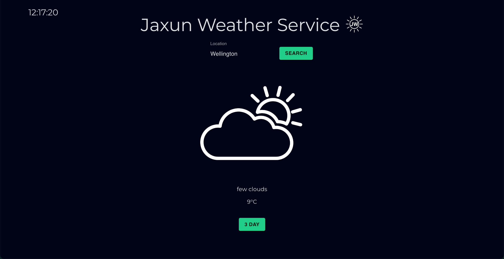
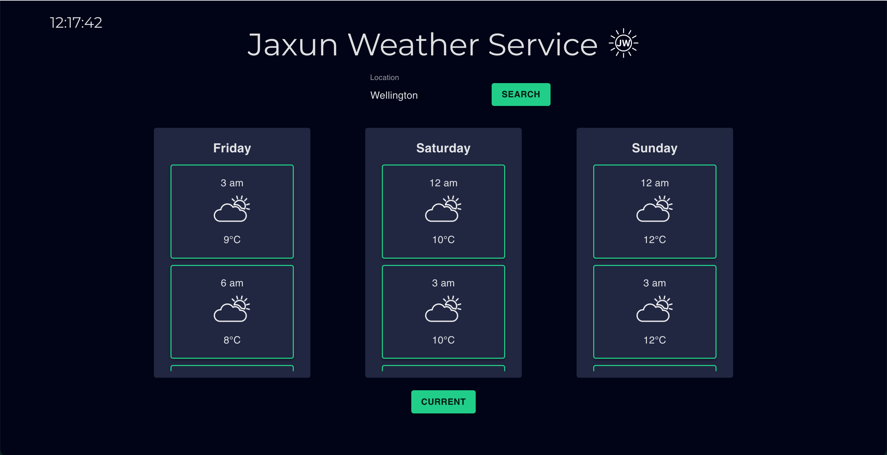
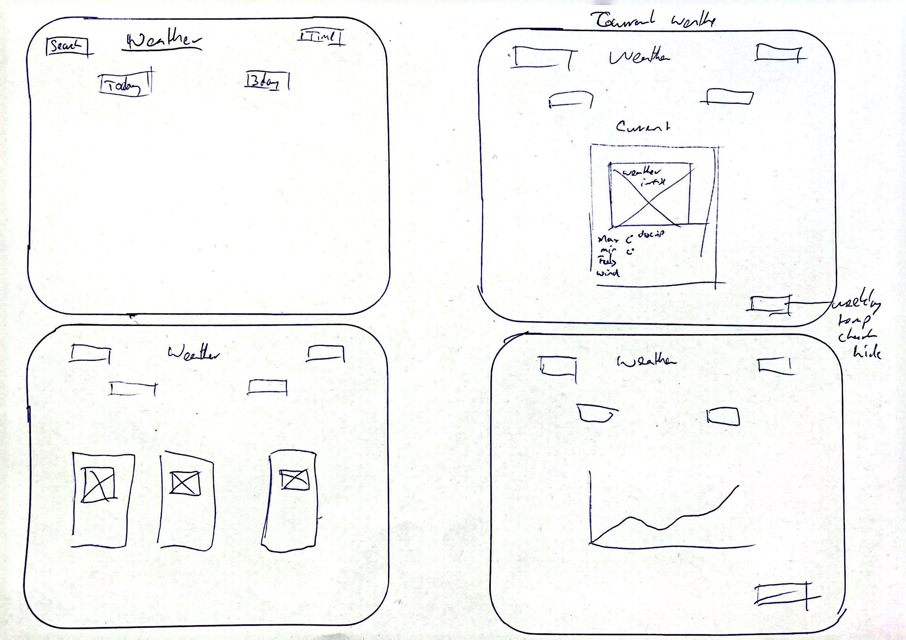

# Jaxun Weather Service

I have built a minimal design weather forcasting app with React.js using API calls to and Express.js backend.

## Screenshots/Demo

## Technologies and Tools

Technologies and tools used to build this project:

  React
  Express.js
  Node.js
  Material-UI

### Deployment

This app is yet to be deployed

### Project Planning

I started the project with some basic wire frames. I wanted a mininmal design without too much noise, keeping it easy on the eyes.

I also used a trello board to keep myself on track and jave the satisfaction of dragging over the completed tasks.

### Extra features

A few addtions and changes I want to make:

- Temperature line chart to map the temp through the day or week
- Have the weather cards give you a average of the day and then more detail when clicked in to them
- More exciting UI, animations etc
- Make it less clunky

### Hurdles

I orginally started making this completely client side, making the API calls from the client. I then refactored the app to make the calls to a express.js backend, for the practice on backend infrastrcutrue and keeping secrets secure. The refactroing process gave me a spot of bother, issues routing and data getting a bit mixed up in places. 

Potential cause of issues was a sense of rushing, which ironcially slowed me down in the end with the errors. I overcame the problems by being more mehtodical, logging step by step and making sure the required data was being given. A good lesson learned. 

## Next Steps?

- I would like to refactor the code, tidy it up, make some more components. 
- Incorporate some more API, potentially a IP address to then feed the weather API.
- Extra widgets
